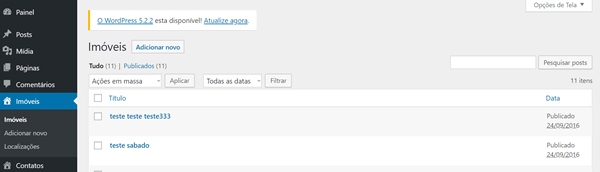
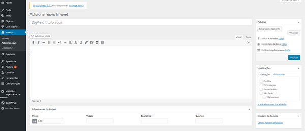
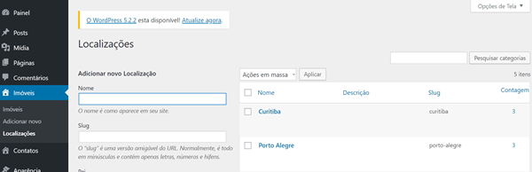
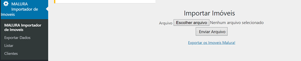
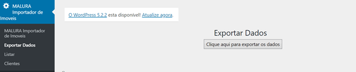
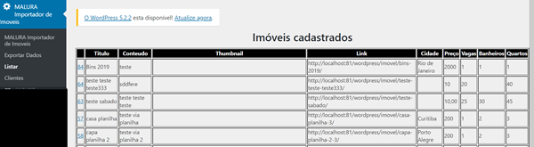
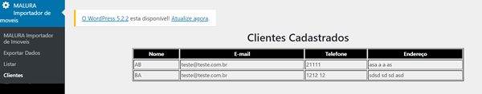

# CUSTOM POST TYPES e PLUGIN - Wordpress

Este repositório tem um plugin personalizado criado durante o curso de "Wordpress - Criando um tema personalizado" feito no Alura.

Neste curso, foi criado um tema, com post personalizados para o cadastro de imóveis

Foi criado um plugin para permitir a importação e exportação de imóveis por planilha.

Existem duas pastas, segue abaixo a descrição do conteúdo

## Tema

Na pasta tema fica o arquivo functions.php responsável por criar os custom post types utilizados no curso. Este arquivo fica dentro da pasta do tema (wp-contents - themes - nome_do_tema)

## Plugin

Nesta pasta tem o plugin que deve ser instalado na pasta wp-contents - plugins e ativado pelo painel administrativo do Wordpress. A importação e exportação de dados é feita pela biblioteca PHPExcel.

O arquivo de importação modelo fica na pasta plugin - templates